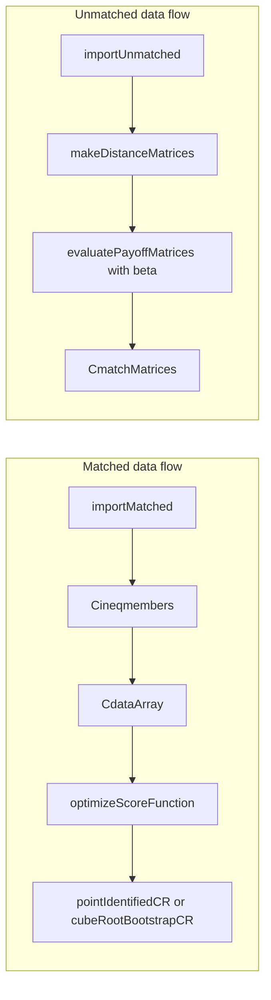

# Maximum Score Estimator

<!-- badges: start -->
<!-- badges: end -->

The **maxscoreest** R package solves the _pairwise maximum score estimation_
problem.

Maximum score estimation is a non-parametric method for estimating parameters in two-sided matching markets: it maximizes the number of inequalities satisfied by the observed matches (relative to counterfactual matchings), without requiring distributional assumptions on unobservables. This package supports both **matched** data (observed matches + distance attributes) and **unmatched** data (separate upstream/downstream files with quotas), and provides point estimation plus confidence regions via subsampling or cube-root bootstrap.

The code builds upon Jeremy Fox’s theoretical work on the “pairwise maximum
score estimator” (Fox 2010; Fox 2018) and the original Match Estimation toolkit
(Santiago and Fox, 2009) which can be downloaded from <http://fox.web.rice.edu/>.

To understand the present code the user needs to be familiar with the maximum
score estimator and formal matching games. To ease the exposition, this
documentation and the code itself follow closely the terminology used by Jeremy
Fox. Unless stated otherwise, please refer back to the original sources for
definitions and technical details accessible via the links at the bottom of this
document.

## Authors

This package was designed by Theodore Chronis, Christina Tatli, and Panaghis
Mavrokefalos, in collaboration with Denisa Mindruta.

## Installation

You can install the development version of **maxscoreest** from
[GitHub](https://github.com/) with:

```r
install.packages("devtools")
devtools::install_github("MaximumScoreEstimator/MSE-R")
```

## Workflows

Two main workflows correspond to your data and goal:

- **I have matched data (observed matches + distance attributes) and want to estimate parameters (and possibly confidence regions).** Use the **matched** workflow: see the Example below and `vignette("matched")`. Pipeline: `importMatched` → `Cineqmembers` → `CdataArray` → `optimizeScoreFunction` → optional `pointIdentifiedCR` or `cubeRootBootstrapCR`.
- **I have unmatched data (separate upstream/downstream files and quotas) and a known parameter vector β; I want to compute the optimal matching.** Use the **unmatched** workflow: see `vignette("unmatched")`. Pipeline: `importUnmatched` → `makeDistanceMatrices` → `evaluatePayoffMatrices(..., beta)` → `CmatchMatrices`. The unmatched workflow does **not** estimate β; it requires a known β (e.g. from theory or from a separate matched-data estimation).



### Data requirements

- **Matched**: One file (e.g. CSV) with columns: Market, UpStream, DownStream, distance attributes, Match. Indices consecutive from 1; numeric distances. See `?importMatched` for details.
- **Unmatched**: Two files (upstream, downstream): Market, Stream (or UpStream/DownStream), attribute columns, Quota. See `?importUnmatched`.

## Example

A demonstration using synthetic data:

```r
library(maxscoreest)
filename <- system.file("extdata", "precomp_testdata.dat", package = "maxscoreest")
matchedData <- importMatched(filename)
ineqmembers <- Cineqmembers(matchedData$mate)
dataArray <- CdataArray(matchedData$distanceMatrices, ineqmembers)
bounds <- makeBounds(matchedData$noAttr, 100)
optimParams <- getDefaultOptimParams()
set.seed(42)
optResult <- optimizeScoreFunction(
    dataArray = dataArray,
    bounds = bounds,
    optimParams = optimParams,
    getIneqSat = TRUE,
    permuteInvariant = TRUE
)
print(optResult$optArg)
print(optResult$optVal)
print(calcPerMarketStats(optResult$ineqSat, makeGroupIDs(ineqmembers)))
```

Results can be sensitive to parameter choices: changing the random seed or optimization settings (e.g. bounds, `optimParams`) can lead to substantially different estimates. We recommend setting a seed, using `permuteInvariant = TRUE`, and `numRuns > 1` when stability or reproducibility matters.

## Documentation

| Vignette | When to use |
|----------|-------------|
| **Matched data** (`vignette("matched", ...)`) | Full estimation workflow and confidence regions from matched data. |
| **Unmatched data** (`vignette("unmatched", ...)`) | Optimal matching from unmatched data given a known β. |
| **Cube-root bootstrap** (`vignette("cubeRootBootstrap", ...)`) | Confidence regions using the cube-root bootstrap method (Cattaneo et al.). |
| **Glossary** (`vignette("glossary", ...)`) | Parameter and notation reference (e.g. `mIdx`, `noAttr`, `dataArray`). |

Open any vignette: `browseVignettes("maxscoreest")` or e.g. `vignette("matched", package = "maxscoreest")`.

## Workbook templates

Runnable end-to-end scripts are shipped with the package. Copy the file to your working directory and edit paths/parameters as needed.

- **Matched flow**: `system.file("workbooks", "matched.R", package = "maxscoreest")` — full matched-data pipeline (estimation + point-identified confidence regions).
- **Unmatched flow**: `system.file("workbooks", "unmatched.R", package = "maxscoreest")` — optimal matching from unmatched data and a given β.

## Troubleshooting

- **Results change when I change the random seed.** The optimizer (Differential Evolution) is non-deterministic and the objective can have many equivalent optima. Set `set.seed()` for reproducibility of a single run, and use `numRuns > 1` in `optimizeScoreFunction()` to collect several runs and keep the best (see the sensitivity note above).
- **How do I choose bounds for the parameters?** Start with symmetric bounds such as `makeBounds(noAttr, 100)`. Adjust if you have prior knowledge about the scale of your attributes or if the optimizer hits the boundary.
- **Which confidence-region method should I use?** Use `cubeRootBootstrapCR()` for cube-root asymptotics (recommended when the number of markets is the relevant sample size). Use `pointIdentifiedCR()` for the point-identified subsampling approach; you must choose the subsample size `ssSize`.

## References

- David Santiago and Fox, Jeremy. “A Toolkit for Matching Maximum Score
  Estimation and Point and Set Identified Subsampling Inference”. 2009. Last
  accessed from
  <http://fox.web.rice.edu/computer-code/matchestimation-452-documen.pdf>
- Fox, Jeremy, “Estimating Matching Games with Transfers,” 2018. Last accessed
  from <http://fox.web.rice.edu/working-papers/fox-matching-maximum-score.pdf>
- Fox J. 2010. Identification in matching games. Quantitative Economics 1:
  203–254
- M. D. Cattaneo, M. Jansson, and K. Nagasawa, “Bootstrap-Based Inference for Cube Root Asymptotics”, _Econometrica_, vol. 88, no. 5, pp. 2203–2219, September 2020.
